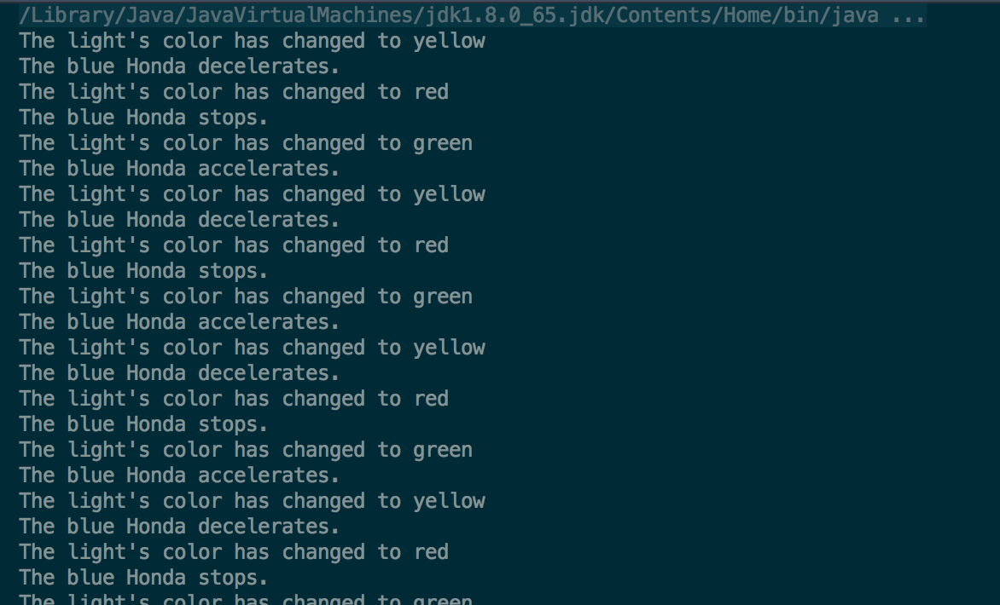

#  Creating Classes

## Exercise

> ***Note:*** _You can help each other, but everyone must submit their own code._

In this lab you will be using your knowledge of classes to create two classes that will be used in the main method. To calculate

### Requirements

##### StopLight Class

Define a `StopLight` class that includes the following:
- Member variables - just one: `mLightColor`
- Constructor: takes no input and sets `mLightColor` to whatever default value you choose
- Methods:
  - Three that take no input and return a boolean based on the current value of `mLightColor`: `isRed()`, `isYellow()`, `isGreen()`
  - One _setter_ method named `setLightColor()` that takes an input, and assigns the value of that input to the `mLightColor` variable. Make sure to handle when invalid input is provided in a call to this method.

##### Car Class

Define a `Car` class that includes the following:
- Member variables: `mColor`, `mBrand`, `mTopSpeed`
- Constructor: takes 3 inputs for color, brand, and top speed, and assigns the values to the corresponding member variables
- Methods:
  - `go()`, `slow()`, `stop()` - each should take no input, return nothing, and print something to the command line that describes what the car is doing
  - _Getter_ methods that return the color, brand, and topSpeed of the car (one for each variable)
  - _Setter_ methods that set the color, brand, and topSpeed of the car (one for each variable)

##### Use Your Classes!

When you create your IntelliJ project, check the "Create project from template" box and select "Command Line App". This will create a Main.java file for you which contains a `Main` class with a `publice static void main()` method. This is the method that will execute when you run your project.

Inside your `main()` method, do the following:
- Instantiate a `StopLight` object using the constructor you wrote, and assign it to a variable of type `StopLight`.
- Instantiate a `Car` object using the constructor you wrote, and assign it to a variable of type `Car`.
- Create a loop that will run 30 times. Inside the body of the loop:
  - Change the color of the stop light. It should follow the real-life sequence - if the light is currently green, change it to yellow. If it's yellow, change it to red. If it's red, change it to green.
  - Make the car react properly to the new light color using the methods you defined for the `Car` class.

**Bonus:**
- Create an array or ArrayList of 20 cars and make them all react to the stop light.
- Randomly have a car run the red light.

#### Starter code

There is no starter code. Create a new project in IntelliJ for this lab inside your forked/cloned repo.

#### Deliverable

Pull request from your forked repo on GitHub that contains your implementation of the `StopLight` class, the `Car` class, and the `main()` method that uses the classes you created.

Screenshot of sample output:

## Additional Resources

- Oracle: [Defining a class](https://docs.oracle.com/javase/tutorial/java/javaOO/classes.html)
- Oracle: [Instantiating a class](https://docs.oracle.com/javase/tutorial/java/javaOO/objects.html)

---

## Licensing
1. All content is licensed under a CC­BY­NC­SA 4.0 license.
2. All software code is licensed under GNU GPLv3. For commercial use or alternative licensing, please contact [legal@ga.co](mailto:legal@ga.co).
